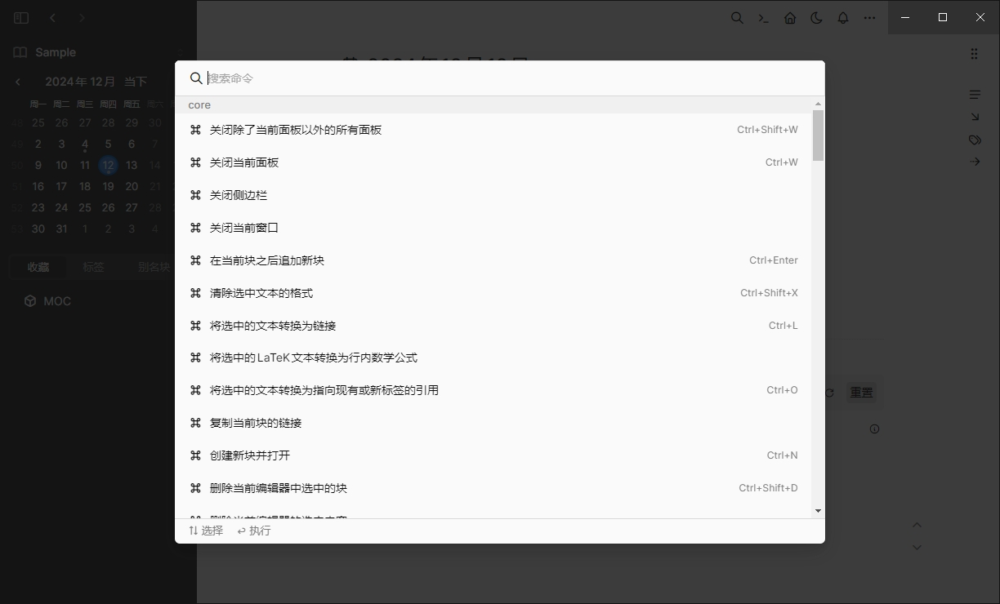

按`Ctrl/CMD + P`打开命令面板，输入以下命令：

## 快捷键

| 快捷键 | 功能 |
| --- | --- |
| `Ctrl/cmd + P` | 命令面板 |
| `Ctrl/cmd + W` | 关闭当前面板 |
| `Ctrl/cmd + Enter` | 在当前块之后追加新块 |
| `Ctrl/cmd + Shift + X` | 清除当前选中文本的格式 |
| `Ctrl/cmd + L` | 将选中的文本转化为链接 |
| `Ctrl/cmd + O` | 将选中的文本转换为指向现有或新标签的引用 |

