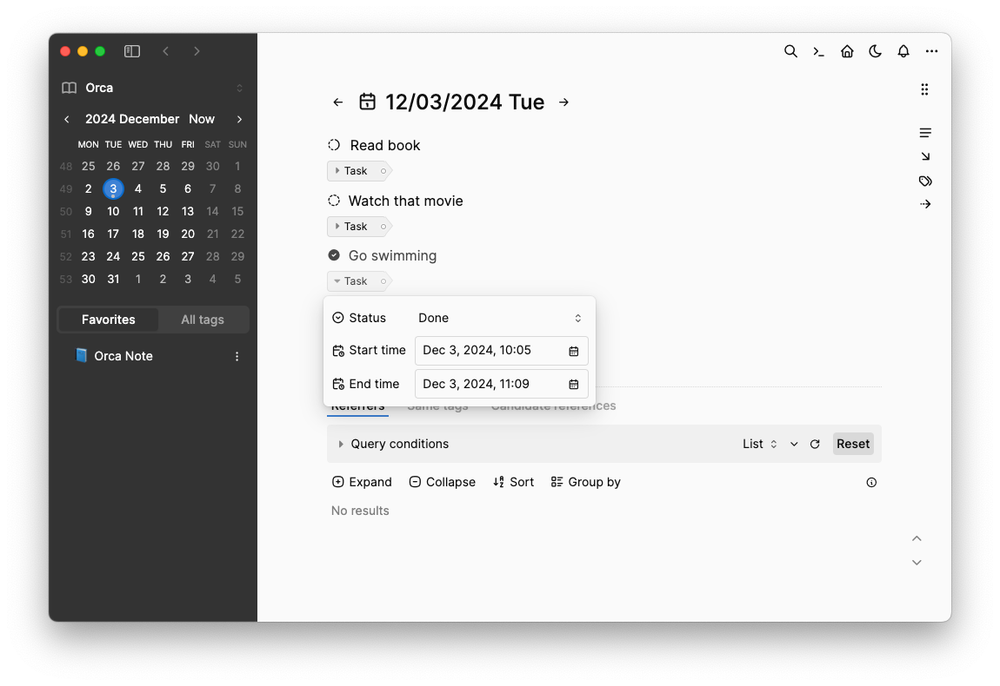
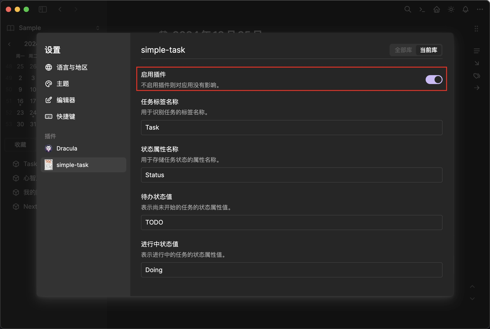

一个创建任务的虎鲸笔记插件

同时也是创建虎鲸笔记插件的模板

## 使用方法

将项目的文件夹放入虎鲸笔记的插件文件夹中（虎鲸笔记的文件夹在你的用户文件夹中，如/Users/username/Documents/orca, C:\Users\username\Documents\orca）。

在项目的根目录中运行`pnpm build`，以构建插件。

开启/重新启动虎鲸笔记，你可以找到应用的设置项下的插件选项，激活插件即可愉快地使用了。

在你想创建任务的块上按下 `Alt+Enter`，插件会为你自动添加一个任务标签，当你再次按下`Alt+Enter`，它会循环切换任务状态。

## 插件使用示例

1. 下载GitHub中或官方123网盘中的`simple-task-1.2.zip`插件压缩包

2. 将解压后的`simple-task`文件夹放置于虎鲸笔记的plugin文件夹

3. 打开笔记软件的设置（快捷键`⌘+,`），激活simple-task插件

4. 在想要转换为任务的笔记块上点击`Alt+Enter`，即可完成任务状态的切换（ TODO / DOING / DONE 三种任务状态循环）。

