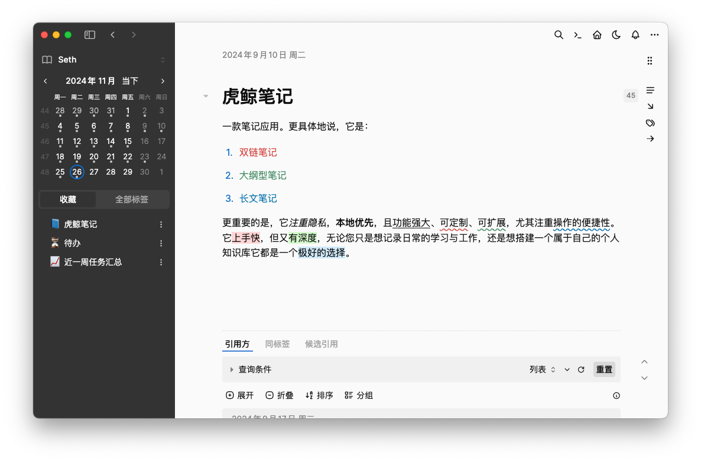

## 虎鲸笔记官方 README 文件
https://github.com/sethyuan/orca-note/blob/main/README.zh.md

一个易于使用的笔记应用，适合大纲与长文写作。

UI界面截图视频：

https://github.com/user-attachments/assets/47eaeae5-4bc3-4702-a817-9fb2cde33b3f

<video width="100%" controls>
  <source src="../assets/orca-note-ui.mp4" type="video/mp4">
  您的浏览器不支持视频标签。
</video>

## 注意

目前应用处于公测阶段，因此可能会出现一些bug。请定期备份您的数据（虎鲸笔记也会在您保持运行的情况下每小时自动备份您的数据）

## 在macOS上运行

由于该应用仍在早期开发阶段，它尚未被签名。要运行它，您必须在安装应用后打开系统终端并执行以下命令：

```bash
xattr -r -d com.apple.quarantine /Applications/Orca\ Note.app
```

## 进一步了解虎鲸笔记

- 更多内容请参考 [虎鲸笔记官方网站](https://orca-note.org/)

## 联系作者Seth


